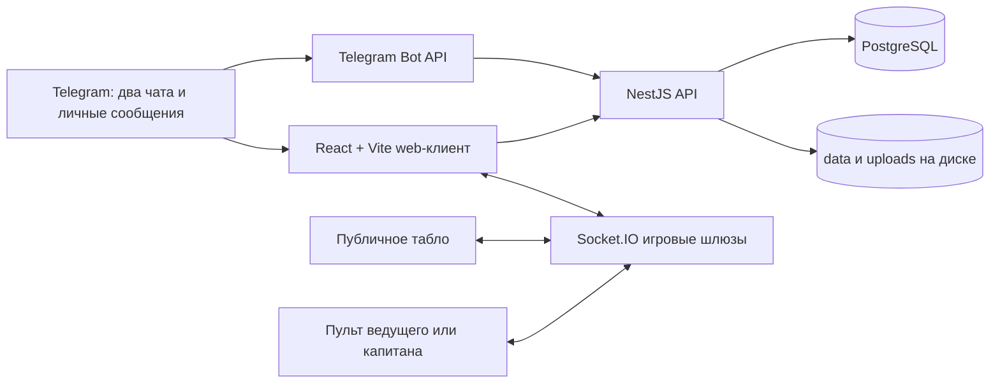
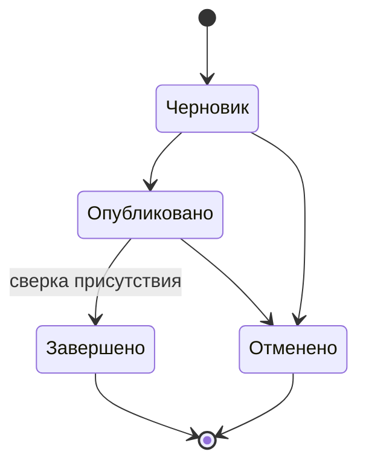

# Архитектура платформы студсовета

Документ фиксирует согласованную продуктовую модель, текущее устройство системы
и направление развития. Он нужен как единая точка опоры для разработки,
тестирования и обсуждения правил с администраторами студсовета.

Актуальность: 14 сентября 2026 года.

## 1. Назначение и границы продукта

Платформа — не только набор игр, а единая среда студсовета для трёх задач:

1. организация мероприятий и оперативный сбор людей;
2. прозрачный учёт участия, надёжности и активности сообщества;
3. проведение очных игр с проектором, ведущим и командами.

Telegram является каналом идентификации, коммуникации и мобильных пультов, но
не единственным интерфейсом. Веб-приложение остаётся полноценной точкой входа,
а игровые табло всегда доступны как обычные публичные web-view без Telegram.

Экосистема участников ограничена двумя основными чатами:

- «Корпус СС | Важное» — официальный информационный контур;
- «СТУДСОВЕТ | ФЛУД» — контур повседневного общения и активности.

В профиле хранится членство в каждом чате отдельно. Автоматическое расширение
реестра на произвольные новые чаты, куда когда-либо добавили бота, не является
частью продуктовой модели.

## 2. Статус функций

В документе используются три статуса:

- **реализовано** — функция присутствует в текущем приложении;
- **частично** — рабочая основа есть, но сценарий или хранение ещё не завершены;
- **запланировано** — согласованное направление, которого пока нет в коде.

## 3. Общая схема



Один NestJS-процесс обслуживает HTTP API, Telegram polling, Socket.IO и
собранный frontend. На VPS запросы принимает Caddy, который завершает TLS и
проксирует трафик приложению. PostgreSQL работает отдельным контейнером.

## 4. Роли и права

| Роль | Возможности |
| --- | --- |
| Участник | смотреть доступные разделы, редактировать свой профиль, отвечать на мероприятия, участвовать в играх |
| Капитан | управлять своей командой в конкретной игровой комнате по ключу |
| Ведущий | управлять конкретной игрой по отдельному секретному ключу |
| Координатор мероприятия | редактировать порученное мероприятие, писать его участникам, сверять присутствие |
| Администратор | редактировать всех участников, мероприятия и настройки, управлять активными комнатами и ограничениями |
| Корневой администратор | назначать администраторов; определяется через `TELEGRAM_ADMIN_IDS` и не удаляется из панели |

Делегированные администраторы хранятся в `platform_admins` и выбираются из
реестра участников. Пользователь не должен подтверждать собственную работу,
если для мероприятия включена координаторская сверка.

## 5. Аутентификация и маршруты

### Защищённые страницы

Основной вход выполняется одним из двух способов:

- Telegram Mini App передаёт подписанный `initData`;
- обычный сайт использует Telegram Login Widget.

Backend проверяет подпись Telegram, членство в разрешённом контуре и выдаёт
подписанную сессию. `SESSION_SECRET` обязателен на сервере: случайный ключ
разлогинивает всех после перезапуска. Тестовый вход допустим только временно и
должен защищаться длинным `TEST_AUTH_KEY`.

SPA fallback обязан отдавать `index.html` при прямом открытии и refresh
клиентского маршрута. API-маршруты при этом не должны попадать в SPA fallback.

### Игровые ссылки

- табло — публичный web URL, открывающийся на проекторе, ноутбуке или телефоне;
- пульт ведущего — web URL или Telegram deep link с ключом ведущего;
- пульт капитана — web URL или Telegram deep link с ключом команды.

Telegram не требуется для открытия табло. Ключи ведущего и капитанов являются
capability-токенами: владение ссылкой даёт ограниченное право управления только
конкретной комнатой. Их нельзя писать в логи или показывать посторонним.

## 6. Реестр участников

### Источники данных

Первичная загрузка участников двух чатов выполняется из Telegram-экспорта CSV.
Bot API не предоставляет способ получить полный список уже существующих
участников обычной группы. После импорта бот поддерживает актуальность через
`chat_member` updates о вступлении, выходе и изменении статуса.

Для получения этих обновлений бот должен иметь необходимые права. Исторически
пропущенные вступления автоматически не восстанавливаются и требуют повторного
импорта или ручной сверки.

### Профиль

Профиль участника содержит:

- Telegram ID, актуальные Telegram name, username, ссылку и фотографию;
- имя, затем фамилию;
- факультет;
- форму обучения: бакалавриат, магистратура, аспирантура или специалитет;
- курс (1–6);
- дату рождения;
- членство в «Важном» и «Флуде» независимо друг от друга.

Имя из CSV может быть названием контакта экспортировавшего пользователя,
поэтому приоритет имеют данные, подтверждённые самим Telegram. Сам пользователь
редактирует свой профиль, администратор — профиль любого участника.

Таблица участников использует общий компонент таблиц: поиск, фильтры,
многокритериальную сортировку, перестановку, скрытие, закрепление и изменение
ширины колонок, пагинацию и CSV-экспорт. Состояние представления сохраняется
локально, а фильтры и сортировка могут отражаться в URL.

## 7. Мероприятия

### Жизненный цикл



Карточка мероприятия содержит название, описание, место, дату и время, теги,
категорию, длительность, координаторов, правила уведомлений и необходимость
подтверждения присутствия. Мероприятие можно изменять после создания; при
существенном изменении опубликованного события участники должны получить
понятное уведомление.

Теги создаются свободно и затем переиспользуются. Они классифицируют работу,
но сами по себе не меняют сложность: базовая оценка зависит от категории и
времени.

### Отклики

После публикации бот предлагает три действия:

- «Иду»;
- «Не иду» — с причиной отказа;
- «Пока думаю».

Для `going` и `maybe` настраиваются отдельные сценарии напоминаний. Правило
может быть относительным («за 24 часа») или абсолютным («10 сентября в 18:00»).
Есть значения по умолчанию, но при создании и редактировании события
координатор может собирать собственный набор правил.

Координатору нужен канал рассылки отдельно всем записавшимся и всем, кто пока
думает. Telegram сможет написать человеку только если тот ранее разрешил
личные сообщения боту или самостоятельно начал диалог.

### Подтверждение присутствия

При включённой двухфакторной сверке:

1. перед мероприятием участник получает адрес, контакт координатора и указания;
2. на месте координатор получает короткий одноразовый код;
3. участник отправляет код через приложение;
4. координатор видит список и фиксирует итог вручную;
5. только финализированное присутствие создаёт баллы и меняет надёжность.

Операция финализации должна быть идемпотентной: повторное нажатие не начисляет
баллы второй раз. Сейчас это обеспечено уникальностью `(event_id, user_id)` в
`score_entries` и списком обработанных событий в хранилище надёжности.

## 8. Рейтинг и надёжность

### Баллы за мероприятие — реализовано

Базовые ставки отражают приоритет человеческого ресурса над развлечениями:

| Категория | Баллов за час |
| --- | ---: |
| Волонтёрская работа | 55 |
| Развлекательное мероприятие | 25 |
| Прочее | 15 |

Формула начисления:

```text
base = ставка категории × длительность в часах
eventPoints = round(base × urgencyMultiplier × courseMultiplier)
```

Срочность определяется дельтой между публикацией и началом. При запасе от семи
дней множитель равен 1; затем он растёт экспоненциально и ограничен 4:

```text
urgencyMultiplier = min(4, 2 ^ ((7 - leadDays) / 3))
```

Коэффициент курса компенсирует снижение свободного времени на старших курсах:

```text
courseMultiplier = 1 + (course - 1) × 0.05
```

То есть каждый следующий курс добавляет 5%. Это текущая техническая формула;
после накопления статистики её следует откалибровать на реальных данных.

### Надёжность — реализовано, хранение временное

Надёжность находится в диапазоне 0–100:

- неявка без предупреждения после ответа «Иду» сбрасывает её в 0;
- отмена не позднее чем за 3 часа: −40;
- отмена не позднее чем за 24 часа: −25;
- отмена не позднее чем за 72 часа: −15;
- более ранняя отмена: −5.

Для восстановления нужно набрать три единицы подтверждённого участия:

- волонтёрство: 1 единица;
- прочее: 0,75;
- развлечение: 0,5.

Итоговый человеческий рейтинг сейчас рассчитывается так:

```text
rating = round(sum(eventPoints) × (0.5 + reliability / 200))
```

При надёжности 100 сохраняются все баллы, при 0 — половина. Баллы хранятся в
PostgreSQL, но профили надёжности пока находятся в `reliability.json`; это
главный кандидат на миграцию в транзакционный журнал PostgreSQL.

### Активность в чатах — сбор реализован, влияние на рейтинг не включено

Система агрегирует по дням:

- все доступные боту сообщения;
- поставленные реакции;
- полученные реакции;
- текущий стрик дней общения.

Telegram-ограничения: бот должен получать обычные сообщения и обновления
реакций; Privacy Mode необходимо отключить, а требуемые права — выдать.
Сообщения других ботов, часть анонимных действий и пропущенная история не могут
быть корректно атрибутированы. Сейчас эти показатели видны как статистика, но
не дают рейтинговых баллов. Формула стрика и защита от спама должны быть
согласованы до включения в общий рейтинг.

### Запланированные механики

- ачивки за стрик общения;
- реальные привилегии: проходки, доступ к событиям и розыгрыши;
- поздравления с днём рождения;
- теневой запрет участия в рассылках и розыгрышах.

Теневой запрет должен запускаться специальной реакцией координатора во
«Флуде», после чего бот рассылает администраторам запрос с именем пользователя
и счётчиками «за/против». Ограничение применяется только после согласованного
кворума. Инициатор не может единолично выставить пользователю метку.

## 9. Игровая подсистема

Реализованы «Колесо удачи», «Поле чудес» и «Своя игра».

Типичный очный сценарий:

1. администратор создаёт комнату с ноутбука;
2. табло открывается обычной ссылкой на компьютере с проектором;
3. ведущий получает свой пульт по QR или ссылке;
4. капитаны получают командные пульты;
5. все интерфейсы синхронизируются через Socket.IO.

QR-кнопки разделены на две зоны: иконка открывает QR, текст открывает саму
ссылку. Для всех игр используются названия «Водящий», «Капитаны», «Табло».

Активные комнаты «Своей игры» и «Поля чудес» сейчас живут в памяти процесса.
Администратор видит их в панели и может завершить принудительно. Перезапуск
backend завершает комнаты и разрывает сокеты — это осознанное текущее
ограничение и причина не перезапускать backend во время игры.

### Колоды и медиа

Колоды «Своей игры» хранятся в PostgreSQL. Колода может быть приватной или
опубликованной; приватную можно передать по коду доступа, отдельно разрешив
или запретив копирование. Счётчики просмотров и копий хранятся с колодой.

Изображения, аудио и видео загружаются через media API, а не вставляются в виде
ручного текста URL. Файлы лежат в постоянном каталоге `uploads`, ссылки — в
содержимом колоды. Вопросы и ответы поддерживают воспроизведение видео на табло
и телефоне капитана. При удалении ссылки на медиа необходимо удалять файл,
только если он больше не используется ни одной колодой; для этого нужен явный
учёт ссылок или сборщик сирот.

## 10. Административная панель

Реализованы:

- глобальное включение и отключение разделов;
- назначение и снятие делегированных администраторов;
- редактирование профилей всех участников;
- мониторинг активных игровых комнат и их завершение;
- запрет отдельным пользователям создавать новые игровые комнаты.

Управляемые разделы: мероприятия, рейтинг, участники, колесо, «Поле чудес» и
«Своя игра». Клиент не должен показывать ни одной управляемой вкладки, пока не
получит конфигурацию сервера. При малом количестве вкладок навигация растягивает
их на доступную ширину с сохранением горизонтальных отступов.

Текущий долг: server-side fallback feature flags равен `true`. Чтобы поведение
строго соответствовало правилу «по умолчанию всё выключено», fallback следует
заменить на `false` и явно инициализировать нужные флаги в `platform_settings`.

## 11. Владение данными

| Данные | Текущее хранилище | Переживает restart | Комментарий |
| --- | --- | --- | --- |
| Участники и членство в чатах | PostgreSQL | да | основной реестр |
| Активность и реакции | PostgreSQL | да | дневные агрегаты и связь реакций с сообщением |
| Колоды и права доступа | PostgreSQL | да | содержимое в JSONB |
| Рейтинговые начисления | PostgreSQL | да | идемпотентный журнал |
| Администраторы, флаги, запреты | PostgreSQL | да | настройки платформы |
| Мероприятия | `data/*.json` | да | требуется миграция в PostgreSQL |
| Надёжность | `data/reliability.json` | да | требуется журнал в PostgreSQL |
| Медиа | persistent `uploads/` | да | необходим backup и сборка сирот |
| Активные игровые комнаты | память процесса | нет | требуется Redis/БД для восстановления |

JSON-файлы записываются атомарно, но не дают полноценных транзакций между
мероприятием, надёжностью и начислением баллов. Целевая модель — PostgreSQL как
источник истины для всей долговечной предметной области; файловая система
остаётся только для бинарных медиа либо заменяется S3-совместимым хранилищем.

## 12. Деплой и эксплуатация

Тестовый контур работает на `https://test.traapp.ru`:

```text
Internet → Caddy :443 → app :3000 → PostgreSQL
                              └── Telegram Bot API через SOCKS/HTTP proxy
```

Команды быстрого деплоя:

```bash
npm run deploy:test:front  # только frontend, backend и комнаты не трогаются
npm run deploy:test:fast   # frontend + backend без тестов
npm run deploy:test        # тесты, сборка и полный deploy
npm run deploy:test:image  # перестройка Docker image
```

Обычный pipeline собирает артефакты локально, передаёт их по rsync, создаёт
версию в `.releases`, атомарно переключает frontend/backend и проверяет
публичный health-check. При ошибке возвращается предыдущий release. Изменения
Dockerfile или зависимостей требуют `deploy:test:image`.

GitHub Actions может деплоить ветку `test`; ему нужны secrets `VPS_SSH_KEY` и
`VPS_HOST_KEY`, а адрес может задаваться `SPREES_HOST`.

На российском VPS Telegram Bot API вызывается через `TELEGRAM_PROXY_URL`.
Прокси относится только к Telegram, а не ко всему серверу. Одновременно polling
с одним токеном должен выполнять ровно один процесс; на остальных задаётся
`TELEGRAM_POLLING=0`.

## 13. Отказоустойчивость и резервирование

Текущий уровень достаточен для тестирования, но не для гарантированного
проведения критичного мероприятия без подготовки.

Основные риски:

- restart backend уничтожает активные игровые комнаты;
- потеря PostgreSQL volume уничтожит реестр, колоды и баллы;
- потеря `data` или `uploads` уничтожит мероприятия, надёжность или медиа;
- недоступность Telegram/proxy блокирует новый вход, polling и уведомления;
- Socket.IO зависит от стабильного соединения аудитории с VPS;
- один app-контейнер является единственной точкой отказа.

Минимальный эксплуатационный набор:

1. ежедневный `pg_dump` с хранением вне VPS;
2. ежедневная копия `deploy/data` и `deploy/uploads`;
3. проверяемое восстановление backup хотя бы раз в месяц;
4. health-check HTTP, PostgreSQL, Telegram polling и очереди напоминаний;
5. алерт по ошибкам приложения и заполнению диска;
6. frontend-only deploy во время активных игр;
7. предварительное открытие табло и пультов перед мероприятием.

Целевой следующий шаг для высокой доступности — вынести игровое состояние и
межпроцессный Socket.IO adapter в Redis, после чего можно безопасно запускать
несколько app-реплик. До этого горизонтальное масштабирование backend запрещено.

## 14. Безопасность и персональные данные

- токен бота, proxy URL, `SESSION_SECRET`, ключи деплоя и доступа к PostgreSQL
  хранятся только в secrets/`.env` и никогда не коммитятся;
- ключи игровых пультов должны быть случайными, ограниченными комнатой и
  сравниваться безопасно;
- изменение рейтинга, присутствия, администраторов и feature flags проверяется
  на backend, а не только скрывается в интерфейсе;
- административные изменения и ручные начисления должны иметь аудит: кто,
  когда, кому и почему изменил значение;
- публичность рейтинга не означает публичность даты рождения, Telegram ID или
  служебных санкций; видимость персональных полей нужно согласовать отдельно;
- удаление пользователя требует политики хранения статистики и обезличивания.

## 15. Приоритетный roadmap

### P0 — целостность и эксплуатация

1. Перенести мероприятия и надёжность из JSON в PostgreSQL.
2. Сделать единый append-only журнал рейтинговых операций и админских правок.
3. Настроить автоматические backup, восстановление и мониторинг.
4. Выключить server-side feature flags по умолчанию и добавить миграцию
   начальной конфигурации.
5. Добавить интеграционные тесты refresh SPA, авторизации и повторной
   финализации мероприятия.

### P1 — завершение мероприятий и рейтинга

1. Довести адресные рассылки координатора и редактор уведомлений.
2. Добавить журнал изменений мероприятия и повторное уведомление при правке.
3. Согласовать антиспам и вес сообщений, реакций и стриков.
4. Добавить ручную корректировку с обязательной причиной и аудитом.
5. Реализовать поздравления с днём рождения.

### P2 — управление сообществом

1. Реализовать голосование координаторов по теневому запрету.
2. Добавить правила проходок, розыгрышей и привилегий.
3. Ввести периоды рейтинга и архив сезонов, чтобы старые заслуги не делали
   таблицу неподвижной навсегда.

### P3 — устойчивость игр

1. Перенести активные комнаты в Redis и поддержать восстановление.
2. Добавить reconnect/resume для ведущего и капитанов.
3. Вынести медиа в S3-совместимое хранилище, добавить ссылки/сборку сирот.
4. Провести нагрузочный тест Socket.IO перед большим мероприятием.

## 16. Архитектурные инварианты

Эти правила не должны нарушаться последующими фичами:

1. Табло доступно без Telegram и не содержит управляющих секретов.
2. Telegram-пульт управляет только своей комнатой и ролью.
3. Баллы появляются только после подтверждённого и финализированного участия.
4. Повтор события или запроса не создаёт повторное начисление.
5. Волонтёрская работа весит существенно больше развлечения.
6. Неявка влияет прежде всего на надёжность, а надёжность — на общий рейтинг.
7. Реестр отражает отдельно членство в «Важном» и «Флуде».
8. Клиентские ограничения всегда дублируются проверками backend.
9. Любое административное влияние на человека должно быть объяснимым и
   аудируемым.
10. Deploy frontend не должен прерывать идущую игру.

